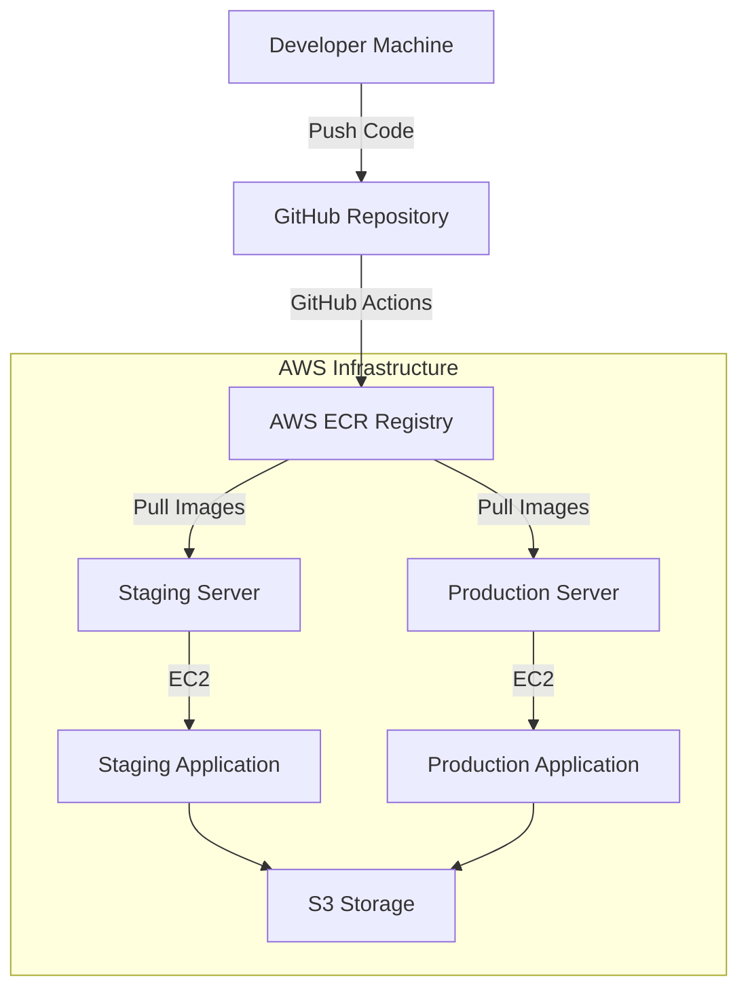

# YendorCats CI/CD & Deployment Guide

## Overview

This guide provides comprehensive instructions for deploying the YendorCats application to AWS environments using automated scripts, ECR (Elastic Container Registry), and Docker containers.

## Architecture



## Prerequisites

### Local Development Machine
- **AWS CLI** installed and configured
- **Docker** installed (OrbStack preferred on macOS)
- **Git** access to the repository
- **Node.js 18+** for file uploader service
- **.NET 8 SDK** for backend development

### AWS Account Setup
- AWS Account with appropriate permissions
- ECR repositories created
- EC2 instances for staging and production
- S3 bucket for file storage (Backblaze B2 compatible)
- Secrets Manager for sensitive configuration

## Quick Start

### 1. Verify AWS CLI Setup
```bash
# Check AWS CLI installation and authentication
./deployment-scripts/aws/verify-aws-setup.sh

# Configure AWS CLI if needed
aws configure
```

### 2. Build and Push to ECR
```bash
# Build all services and push to ECR
./deployment-scripts/deploy/build-and-push.sh

# Or use the existing Makefile
make deploy
```

### 3. Deploy to Staging
```bash
# Deploy to staging environment
./deployment-scripts/deploy/deploy-staging.sh
```

### 4. Deploy to Production
```bash
# Deploy to production environment (requires confirmation)
./deployment-scripts/deploy/deploy-production.sh
```

## Directory Structure

```
scripts/
├── README.md                    # This guide
├── aws/                         # AWS-specific utilities
│   ├── verify-aws-setup.sh     # Verify AWS CLI configuration
│   ├── ecr-login.sh            # ECR authentication
│   └── setup-secrets.sh        # Secrets Manager setup
├── deploy/                      # Deployment scripts
│   ├── build-and-push.sh       # Build and push to ECR
│   ├── deploy-staging.sh       # Deploy to staging
│   ├── deploy-production.sh    # Deploy to production
│   └── rollback.sh             # Rollback deployment
├── server/                      # Server-side scripts
│   ├── install-docker.sh       # Install Docker on server
│   ├── setup-server.sh         # Initial server setup
│   ├── pull-and-deploy.sh      # Pull from ECR and deploy
│   └── health-check.sh         # Application health checks
└── utils/                       # Utility scripts
    ├── cleanup-images.sh       # Clean up old Docker images
    ├── backup-data.sh          # Backup application data
    └── monitor-logs.sh         # Monitor application logs
```

## Environment Configuration

### Staging Environment
- **URL**: `https://staging.yendorcats.com`
- **ECR Tags**: `staging`, `latest-staging`
- **Environment**: `Staging`
- **Auto-deploy**: On push to `develop` branch

### Production Environment
- **URL**: `https://yendorcats.com`
- **ECR Tags**: `production`, `latest`
- **Environment**: `Production`
- **Deploy**: Manual approval required

## Services

### API Service
- **Image**: `025066273203.dkr.ecr.ap-southeast-2.amazonaws.com/yendorcats-api`
- **Port**: 5003 (staging), 80 (production)
- **Health Check**: `/health`

### File Uploader Service
- **Image**: `025066273203.dkr.ecr.ap-southeast-2.amazonaws.com/yendorcats-uploader`
- **Port**: 5002
- **Health Check**: `/health`

### Frontend Service
- **Image**: `025066273203.dkr.ecr.ap-southeast-2.amazonaws.com/yendorcats-frontend`
- **Port**: 80
- **Health Check**: `/health`

## Security & Secrets

### Environment Variables
All sensitive configuration is managed through environment variables:

```bash
# AWS Configuration
AWS_REGION=ap-southeast-2
AWS_ACCOUNT_ID=025066273203

# S3/B2 Configuration
AWS_S3_BUCKET_NAME=yendor
AWS_S3_ACCESS_KEY=<secret>
AWS_S3_SECRET_KEY=<secret>

# Database Configuration
MYSQL_ROOT_PASSWORD=<secret>
MYSQL_USER=yendorcats
MYSQL_PASSWORD=<secret>

# JWT Configuration
YENDOR_JWT_SECRET=<secret>
```

### Secrets Management
Use AWS Secrets Manager for production secrets:
```bash
./scripts/aws/setup-secrets.sh
```

## Troubleshooting

### Common Issues

#### ECR Authentication Failed
```bash
# Re-authenticate with ECR
./scripts/aws/ecr-login.sh
```

#### Container Health Check Failed
```bash
# Check container logs
docker logs yendorcats-api-production

# Run health check script
./scripts/server/health-check.sh
```

#### Image Pull Failed
```bash
# Verify ECR repositories exist
aws ecr describe-repositories --region ap-southeast-2

# Check image tags
aws ecr list-images --repository-name yendorcats-api --region ap-southeast-2
```

## Monitoring & Maintenance

### Log Monitoring
```bash
# Monitor application logs
./scripts/utils/monitor-logs.sh

# View specific service logs
docker logs -f yendorcats-api-production
```

### Cleanup
```bash
# Clean up old Docker images
./scripts/utils/cleanup-images.sh

# Backup application data
./scripts/utils/backup-data.sh
```

## Support

For deployment issues or questions:
- **Email**: jordan@paceyspace.com
- **Documentation**: This guide and inline script comments
- **Logs**: Check application logs for detailed error information

---

### Tags
#deployment #ci-cd #aws #ecr #docker #staging #production #automation #yendorcats #devops

---
